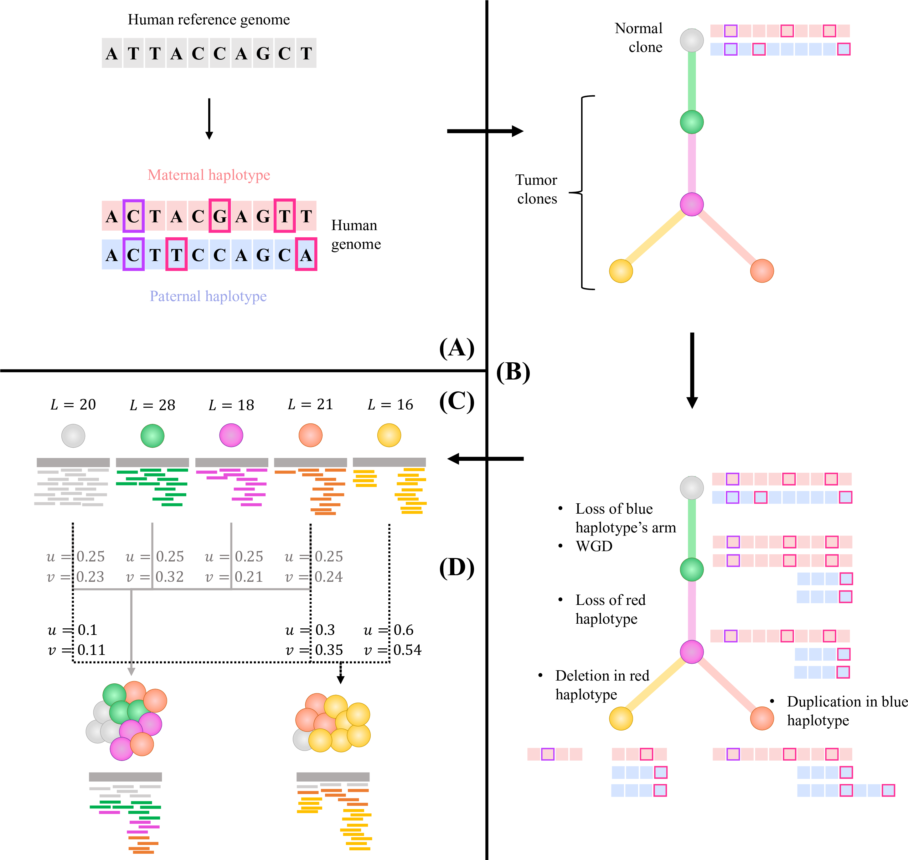

# MASCoTE   <u>M</u>ulti-sample <u>A</u>llele-specific <u>S</u>imulation of <u>T</u>umor <u>C</u>opy-number <u>E</u>volution #

MASCoTE (Multi-sample Allele-specific Simulation of Copy-number Tumor Evolution) is a simulation framework
to generate sequencing reads with appropriately corrections for the differences in genome lengths between the normal and tumor clone(s) present in multiple mixed samples from the same patient. MASCoTE simulates a normal diploid human genome and the genomes of tumor clones characterized by different kind of somatic copy-number aberrations (CNAs) and whole-genome duplications (WGDs) accumulated during an evolutionary process modeled as a phylogenetic tree. Different CNAs include focal CNAs, and CNAs involving chromosomal arms and whole chromosomes. MASCoTE has been designed and developped by Simone Zaccaria in the group of prof. Ben Raphael at Princeton University. The full description of the simulation framework is included together with the HATCHet algorithm in

[Simone Zaccaria and Ben Raphael, 2018](https://www.biorxiv.org/content/early/2018/12/17/496174)

The simulated data and the results of all the methods considered in the comparison are available at

[manuscript's data](https://github.com/raphael-group/hatchet-paper)

## Contents ##

1. [Overview](#overview)
    - [Simulation framework](#simulationframework)
    - [Software](#software)
2. [Setup](#setup)
    - [Dependencies](#dependencies)
    - [Compilation](#compilation)
    - [Required data](#requireddata)
3. [Usage](#usage)
    - [Full pipeline and tutorial](#fullpipelineandtutorial)
    - [Detailed steps](#detailedsteps)
    - [Tips and reccomendations](#tipsandreccomendations)
4. [Current issues](#currentissues)
5. [Contacts](#contacts)

## Overview

### Simulation framework

**Overview of Multiple Allele-specific Simulation of Copy-number Tumor Evolution (MASCoTE) framework.** MASCoTE simulates sequencing reads of multiple mixed samples according to the genome lengths and proportions of all clones. The simulation framework of MASCoTE is composed of four steps. **(A)** MASCoTE simulates a diploid human genome by inserting homozygous (purple square) and heterozygous (magenta squares) germline SNPs in the two haplotypes (red and blue haplotypes). **(B)** MASCoTE simulates the genomes of 4 tumor clones by considering CNAs and WGDs. First, MASCoTE generates a random phylogenetic tree which describes the tumor evolution; the phylogenetic tree is rooted in the normal diploid clone (grey node) and every other node corresponds to a tumor clone (green, fuchsia, orange, and gold nodes). Next, MASCoTE simulates different kind of CNAs for every branch, including aberrations of whole chromosomes or chromosomal’s arms, and focal duplications and deletions. MASCoTE also simulates a WGD in the trunk of the phylogeny. As such, the CNAs and WGDs in each branch are applied in arbitrary order to the genome of the parent clone to obtain the genome of the child clone such that the diploid human genome generated in **(A)** is assigned to the normal diploid clone. **(C)** MASCoTE simulates sequencing reads from the genome of every clone and computes the corresponding genome lengths (_L_). **(D)** MASCoTE simulates multiple mixed samples according to given clone proportions (_u_) by computing the corrected proportions of sequencing reads belonging to each clone (_v_) and by mixing the reads accordingly.

### Software

The current implementation of HATCHet is composed of two main components implemented in python2.7, which are in the `src` folder, and some interfaces in BASH/python2.7 for using other standard methods. Both the modules and interfaces of MASCoTE are implemented to run parallel processes to be more efficient.

## Setup

### Dependencies

The two main modules of MASCoTE are written in python2.7 and only depend on standard packages and libraries, including standard modules for managing the execution of parallel jobs.
The MASCoTE's framework use some standard methods for realistically simulate sequencing reads, mapping sequencing reads, and reading/managing files of sequencing reads (e.g. SAM and BAM files). MASCoTE's framework thus requires the following methods:

| Name and link | Usage | Comments |
|---------------|-------|----------|
| [SAMtools](http://www.htslib.org/doc/) | Reading and managing BAM files, converting SAM files, and sampling and merging BAM files | Tested with the following versions: `1.5`, `1.6`, and `1.7` |
| [BWA](http://bio-bwa.sourceforge.net/) | Mapping sequencing reads to the human reference genome | Tested with the following version: `7.16a` |
| [ART](https://www.niehs.nih.gov/research/resources/software/biostatistics/art/index.cfm) | Simulating sequencing reads with realistic profiles | Tested with the following version `ART-MountRainier-2016-06-05`. More specifically, the module `art_illumina` is used by MASCoTE to generate sequencing reads according to Illumina sequencing technology. |

The scripts of MASCoTE also uses several standard commands that are available in all NIX systems (Linux and MacOS), including `sed` command and others.

### Required data

MASCoTE requires 3 input data:
1. **A human reference genome**. Ideally, one should consider the same human reference genome used to align the sequencing reads in the given BAM files. The most-used human reference genomes are available at [GRC](https://www.ncbi.nlm.nih.gov/grc/human) or [UCSC](http://hgdownload.cse.ucsc.edu/downloads.html#human). Observe that human reference genomes use two different notations for chromosomes: either `1, 2, 3, 4, 5 ...` or `chr1, chr2, chr3, chr4, chr5 ...`. One needs to make sure that the SNP database and reference genome share that same chromosome notation. When this is not the case, one needs to change the reference to guarantee consistency and needs to re-index the new reference (e.g. using [SAMtools](http://www.htslib.org/workflow/#mapping_to_variant)). Also, MASCoTE currently requires the name of the chromosomes in the reference genome is exact and exactly equal to the one in the BAM files, no other labels should be present having `>1 ... \n>2 ... \n>3 ...` or `>chr1 ... \n>chr2 ... \n>chr3`.
2. **A list of known germline SNPs**. This list is optional and SNPs can be introduced in arbitrary positions of the genome. However, we strongly suggest to obtain the lsit from known databases. One of the most used database of germline SNPs is [dbSNP](https://www.ncbi.nlm.nih.gov/projects/SNP/) and the common germline SNPs can be downloaded from the most recent realease [here](https://www.ncbi.nlm.nih.gov/variation/docs/human_variation_vcf/). In order to consider only a subset of the positions to reduce the number of SNPs, the user should sample only some of the positions in this list according to estimated frequency of SNPs (typically 1 SNP every 1000 genomic positions along the entire genome, which approximately correspond to a frequency of `0.000000333`). MASCoTE requires the list to be given in a tab-separate file with the following fields:

| Field | Comment |
|-------|---------|
| `CHR` | Name of a chromosome, required to be present also in the reference genome |
| `POS` | A genomic position corresponding to a germline SNP in `CHR` |
| `REF_ALLELE` | Allele of the reference genome in `POS` |
| `ALT_ALLELE` | Alternate allele of the germline SNP in `POS` |

3. **A list of contig to exclude**. This list is optional but highly reccomended. This is a list containing all the contigs in the given reference genome that should be excluded. An example of this list is given [here](data/ignore.tsv). MASCoTE requires the list to be given in a file with every excluded contig in a new line.

## Usage

### Tutorial for full pipeline and components

This repository contains the two main components of MASCoTE and a full exemplary BASH scripts which encodes the entire pipeline of MASCoTE. We provide an exemplary [BASH script](script/runMASCoTE.sh) that implements the entire framework of MASCoTE. This script, its usage and all the steps are described in detailed in a guided [tutorial](doc/doc_runmascote.md).

In addition, the details of the two main components of MASCoTE are described in corresponding page of the documentation.

| Module | Description |
|--|--|
| [mascotte](doc/doc_mascote.md) | This module generates a human-diploid genome, generates a phylogenetic tree describing the evolution of a collection of tumor clones, and generates the genome of these clones by introducing different kinds of CNAs and WGDs  |
| [MixBAMs](doc/doc_mixbams.md) | This module considers mapped sequencing reads obtained from the genome of individual clones and produces multiple mixed samples according to given clone proportions and with appropriate corrections for the different genome lengths of the clones  |

Observe that MASCoTE is modular and its main steps can be substituted easily in case the user desires to integrate different methods.

### Tips and reccomendations

- To improve the running time, we suggest to run the MASCoTE's framework using a number of parallel jobs as high as possible.
- The number of resulting threads does not have to be necessarily lower than the total number of processors available on the machine. Some overlapping has been shown to not affect the performance significantly.

## Current issues

MASCoTE is in active development, please report any issue or question as this could help the devolment and imporvment of HATCHet. Current known issues with current version are reported here below:

- ...

## Contacts

HATCHet's repository is actively mantained by Simone Zaccaria, currently a postodoctoral research associate at Princeton University in the group of prof. Ben Raphael.
